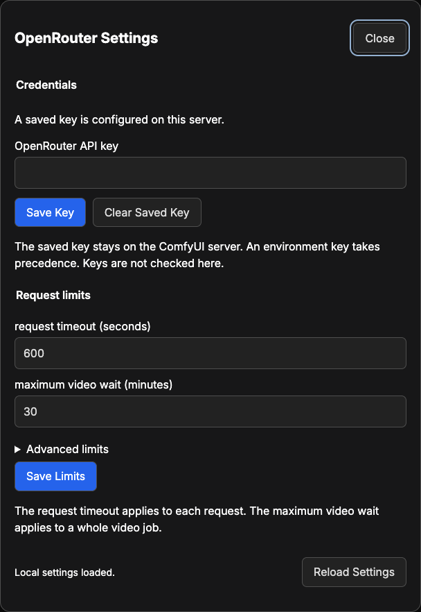

# ComfyUI OpenRouter Advanced Guide

## Contents

- [What each node sends](#what-each-node-sends)
- [Keys and access](#keys-and-access)
- [Settings](#settings)
- [Models](#models)
- [Caching and reruns](#caching-and-reruns)
- [Recover a video](#recover-a-video)
- [Limits](#limits)
- [When a node stops](#when-a-node-stops)
- [Update or remove](#update-or-remove)
- [Development](#development)
- [Package and publish](#package-and-publish)
- [Troubleshooting](#troubleshooting)

## What each node sends

- **Chat: Ask** sends the prompt and the media: images as PNG, videos as MP4,
  and audio as WAV. PDFs go to OpenRouter's PDF engine; text files go as text.
  Earlier turns come from **conversation**. It returns the text, the reasoning
  when the model shares it, and any images the model made. Speech comes back
  as 24 kHz mono PCM.
- **Image: Generate** sends the prompt, the chosen settings, the count, and each
  reference image as PNG. It returns images, their masks (white is
  transparent), and SVG files.
- **Video: Generate** sends the prompt, the chosen settings, and the frames or
  references. It records the job as soon as OpenRouter accepts it, checks it
  every **video check interval**, and downloads the MP4 when it is ready.
- **Video: Download** checks one recorded job and downloads its video. Status
  checks and downloads are free.
- **Audio: Speak** sends the text, the voice, the speed, and the voice sample as
  WAV when one is connected. It returns the audio as PCM or MP3.
- **Audio: Transcribe** sends the clip as WAV, with the language and the
  timestamps you ask for. It returns the text, the segments, SRT subtitles, and
  the timed words.
- **Search: Embed** sends every text line and image in one request. It compares
  each embedding with the first one locally.
- **Search: Rank** sends the query and every text line and image in one request.
  It returns them in order, with their scores.
- **Decision: Ask** sends the situation and the questions to OpenRouter's alpha
  decisions API. **Decision: Read Answer** reads one answer locally.
- **Request Options** adds its settings to each connected paid node's request.

## Keys and access

Save the key in **ComfyUI menu → Extensions → OpenRouter → OpenRouter
settings**. It is stored in the private folder and checked by the first request
that uses it. `OPENROUTER_API_KEY`, set where ComfyUI starts, takes precedence.

The key and settings can be changed only over a direct local connection to the
ComfyUI server. For remote access, a reverse proxy, or multi-user mode, set
`OPENROUTER_API_KEY` instead.

The private folder is:

| System  | Folder                                               |
| ------- | ---------------------------------------------------- |
| macOS   | `~/Library/Application Support/OpenRouterComfyUI`    |
| Linux   | `${XDG_STATE_HOME:-~/.local/state}/openrouter-comfy` |
| Windows | `%LOCALAPPDATA%\OpenRouterComfyUI`                   |

To use another folder, set `OPENROUTER_COMFY_STATE_DIRECTORY` to an absolute
path outside the extension and ComfyUI's folders. Files are unencrypted, with
owner-only permissions.

## Settings

Change these in **OpenRouter settings**. New requests use the saved values.



| Setting                        | Default | Range      | What it limits                                                         |
| ------------------------------ | ------- | ---------- | ---------------------------------------------------------------------- |
| request timeout (seconds)      | 600     | 10 to 3600 | How long one paid request may take.                                    |
| maximum upload size (MiB)      | 64      | 1 to 512   | The media and documents in one request.                                |
| maximum download size (MiB)    | 512     | 16 to 4096 | The largest reply, image, audio, or video accepted.                    |
| parallel requests              | 4       | 1 to 16    | Requests running at once in one ComfyUI run.                           |
| video check interval (seconds) | 15      | 5 to 120   | The time between video status checks.                                  |
| maximum video wait (minutes)   | 30      | 1 to 240   | How long one run waits for a video.                                    |
| video retry delay (minutes)    | 30      | 0 to 1440  | How long an identical video request is refused after an uncertain one. |

## Models

Before it sends, a paid node reads OpenRouter's public listings and stops,
before anything is paid, when:

- the model ID is empty or unknown;
- the model makes something the node does not return, such as a video model in
  **Image: Generate**;
- connected images, video, or audio are media the model does not read;
- **Chat: Ask** asks for images or audio the model does not make, an answer
  schema it cannot follow, or more max tokens than its longest answer;
- **Audio: Speak** has a voice sample and the model cannot clone voices;
- **Image: Generate** asks for a value, count, or number of references the
  model's entry in OpenRouter's image list does not take;
- **Video: Generate** asks for a duration, resolution, aspect ratio, frame,
  sound, or upscale setting the model's entry in OpenRouter's video list does
  not take.

The message names what the model does take. Each listing is read once per model
per ComfyUI session.

The seed, temperature, and reasoning effort go only to models that list them,
and with an answer schema only providers that follow it answer. Every other
setting is sent only when changed from **model default** or 0.

| Node              | Default model                         |
| ----------------- | ------------------------------------- |
| Chat: Ask         | `google/gemini-3.5-flash`             |
| Image: Generate   | `google/gemini-3.1-flash-image`       |
| Video: Generate   | `google/veo-3.1-fast`                 |
| Audio: Speak      | `google/gemini-3.1-flash-tts-preview` |
| Audio: Transcribe | `openai/whisper-large-v3-turbo`       |
| Search: Embed     | `openai/text-embedding-3-small`       |
| Search: Rank      | `cohere/rerank-v3.5`                  |
| Decision: Ask     | `typesafe/jev-1.13`                   |

**Audio: Speak** starts with the voice `Kore`, which its default model needs.

## Caching and reruns

- Change **run number** to send the same request again.
- A **seed** that is not **fixed** changes after each run, so running again
  sends a new request. The examples use **fixed**.
- Saving a different key invalidates the cached results; changing settings does
  not.
- Model checks, video checks, and video downloads are retried up to three
  times. Paid requests are sent exactly once.
- Cancelling stops the wait only: a chat model still bills the tokens it
  produced, and a video job keeps running.

## Recover a video

**Video: Generate** records each job as soon as OpenRouter accepts it. The job
runs to completion even when you cancel, ComfyUI restarts, or **maximum video
wait** passes. Collect it with **Video: Download** (press R to list new jobs),
or run the identical request again.

If the connection closes before OpenRouter confirms a request, an identical one
is refused for **video retry delay (minutes)**. A job leaves the list once its
video is downloaded, or when it fails, is cancelled, or expires.

## Limits

| Item                              | Limit                                                          |
| --------------------------------- | -------------------------------------------------------------- |
| Documents in one chat request     | 8.                                                             |
| Chat prompt                       | 1,000,000 characters.                                          |
| Conversation                      | 200 turns.                                                     |
| Output tokens                     | Up to 1,000,000; 0 leaves it to the model.                     |
| Image side                        | 8192 pixels; larger images are refused.                        |
| Images from one request           | 1 to 10, within the model's own count.                         |
| Video duration                    | Up to 60 seconds; 0 leaves it to the model.                    |
| Speech text                       | 100,000 characters.                                            |
| Voice sample                      | 15 MiB.                                                        |
| Search items in one request       | 256.                                                           |
| Embedding dimensions              | Up to 8192; 0 leaves it to the model.                          |
| Decision questions                | 32; 2 to 32 options; 2 to 10 levels.                           |
| Decision situation                | 200,000 characters.                                            |
| Answer threshold                  | 0.5 by default.                                                |
| Providers in one list             | 32.                                                            |
| Provider options and extra fields | 64 KB each.                                                    |
| Upload and download size          | 64 MiB and 512 MiB by default, set in **OpenRouter settings**. |

## When a node stops

Paid nodes check these before sending, along with the [model checks](#models).

**Chat: Ask** stops when:

- The prompt is empty or too long, or the conversation is too long.
- The media are over the upload limit.
- The answer schema is not a JSON object.
- A field other than **images**, **videos**, or **audio** receives a list of
  several values. The same holds for the media nodes below.

**Chat: Attach Document** stops when:

- No file is chosen, or the file is outside the input folder.
- The file is not a PDF or text file, is over the upload limit, or is not UTF-8
  text.
- More than 8 documents are chained.

**Image: Generate** stops when:

- The prompt is empty.
- A transparent background is asked for with JPEG.

**Video: Generate** stops when:

- There is no prompt and no first frame.
- Frames and references are both connected, or a frame receives more than one
  image.
- An identical request comes within the video retry delay of an uncertain
  submission.

**Audio: Speak** stops when the text is empty or too long, or the voice sample
is too large. **Audio: Transcribe** stops when the language is not a two-letter
code, or the clip is a batch.

**Search: Embed** and **Search: Rank** stop when there are no items or more
than 256. **Search: Rank** also stops when the query is empty.

**Decision: Add Question** stops when the name is invalid or used twice, the
question is empty, the list already has 32 questions, or the answer type's
fields are incomplete.

**Decision: Ask** stops when the situation is empty or too long. **Decision:
Read Answer** stops when no question has the name.

**Request Options** stops when a provider list or a JSON field cannot be read.
A paid node stops when the options include a setting its request does not
accept.

## Update or remove

To update, replace the `custom_nodes/comfyui-openrouter` folder, install its
`requirements.txt` with ComfyUI's Python, and restart. Open the updated
examples in a new tab.

To remove it, move the folder out of `custom_nodes` and restart. The
[private folder](#keys-and-access) stays; delete it to remove the saved key,
settings, and job records.

## Development

### Setup

Point the checks at ComfyUI in `.mise.local.toml`, which Git ignores:

```toml
[env]
COMFYUI_PATH = "/path/to/ComfyUI"
COMFYUI_PYTHON = "/path/to/ComfyUI/.venv/bin/python"
```

Then install the tools, dependencies, Semgrep rules, and Git hooks:

```shell
mise trust && mise run repo:setup
```

### Generated files

```shell
mise run repo:deps:export          # Regenerate requirements.txt from pyproject.toml
mise run comfy:frontend:build      # Build the browser files
mise run comfy:workflows:build     # Build the 13 example workflows
```

The example workflows are generated from `scripts/workflows/descriptions/`:
one module per category, the group notes in `notes.py`, and the titles in
`texts.py`. The build reads the node definitions through ComfyUI's Python.

### Full check

```shell
mise run repo:check                # Run every check below
```

This runs `repo:deps:verify`, `repo:format:check`, `repo:lint`, `repo:type`,
`comfy:frontend:check`, `comfy:nodes:check`, `comfy:workflows:check`,
`repo:security`, `repo:licenses`, and `repo:links:external`.

### Format

```shell
mise run repo:format               # Format Python, pyproject.toml, web, and Markdown files
mise run repo:format:check         # List files that need formatting
```

This uses Ruff for Python, pyproject-fmt for `pyproject.toml`, and Prettier for
web and Markdown files.

### Lint

```shell
mise run repo:lint                 # Run every linter
```

- `repo:lint:policy`: repository structure, naming, and function rules.
- `repo:lint:python`: Ruff, the custom Python rules, import-linter, pydoclint,
  interrogate, deptry, and vulture.
- `repo:lint:frontend`: ESLint, naming, stylelint, knip, madge, and jscpd.
- `repo:lint:shell`, `repo:lint:hooks`, and `repo:lint:mise`: shell syntax,
  ShellCheck, shfmt, and the shell rules.
- `repo:lint:docs`: markdownlint, typos, and local links.
- `repo:lint:quality`: the quality tools and their configuration.

### Types

```shell
mise run repo:type                 # Check Python and TypeScript types
```

This runs basedpyright in strict mode against your ComfyUI installation, and
`tsc` for the browser code.

### Generated-file checks

```shell
mise run comfy:frontend:check      # The browser files match their source
mise run comfy:nodes:check         # The help pages and menus match the nodes
mise run comfy:workflows:check     # The workflows match their descriptions, and the README links each one
```

The workflow check also requires every node to appear in at least one
workflow.

### Security and licenses

```shell
mise run repo:security             # Run the secret, code, and dependency scanners
mise run repo:licenses             # Check dependency licenses
```

`repo:security` runs Gitleaks, Bearer, Bandit, the Python and Bun advisory
audits, Semgrep with the pinned rules, and CodeQL for Python and the browser
code.

### Git hooks

`mise run repo:setup` installs the hooks:

- **pre-commit** checks for private files and staged secrets, then runs the
  source, formatting, type, and browser-file checks.
- **commit-msg** checks the [conventional
  commit](https://www.conventionalcommits.org/) format, `type(scope): subject`.
- **pre-push** runs the full check.

To skip a run, set `SKIP_HOOKS=1`. To skip only part of it, set `SKIP_LINT=1`
(the pre-commit checks), `SKIP_ENV_CHECK=1` (the private-file check), or
`SKIP_COMMITLINT=1` (the commit message check).

### Test a change

Testing is manual: restart ComfyUI after Python changes, or rebuild the
browser files and reload after browser changes, then run the affected
workflows with inexpensive models.

### Code layout

`src/` holds only packages. The package's `__init__.py` holds the `Extension`
class ComfyUI loads, and imports the nodes and routes when ComfyUI calls it.

| Package      | Holds                                                                               |
| ------------ | ----------------------------------------------------------------------------------- |
| `nodes`      | The node classes and the inputs they share                                          |
| `comfy`      | ComfyUI glue: running a request with progress and cancel, media, routes, runtime    |
| `openrouter` | Every request to OpenRouter, the model check, and the one module that sends the key |
| `settings`   | The private settings, their local routes, and the checks that keep them local       |
| `storage`    | The private files: settings, the saved key, and video job records                   |
| `types`      | Records, type aliases, JSON parsing, and the `OpenRouterError` every message uses   |
| `config`     | Constants and messages, with no code                                                |

The build scripts keep their paths in `scripts/paths.py`, the ComfyUI nodes the
workflows use in `scripts/nodes/host.py`, and their type aliases in
`scripts/types.py`.

### Import rules

Each package imports only the packages below it:

```text
src.nodes
src.comfy
src.openrouter | src.settings
src.storage
src.types
src.config
```

- ComfyUI is imported only in `src/nodes/`, `src/comfy/`, and the package's
  `__init__.py`.
- All OpenRouter code is in `src/openrouter/`, and
  `src/openrouter/transport.py` is the one place that sends the key.
- The import contracts in `pyproject.toml` enforce these rules.
- Node names, descriptions, and tooltips are in each node's `io.Schema` call.
- Every other message is a constant in `src/config/messages/`, or in
  `web/scripts/text.ts` for the dialogs. Every other fixed value, such as a
  limit, a step, a file name, or a route, is a constant in `src/config/`.

### Function names

Every function in `src/`, `scripts/`, and `__init__.py` starts with a verb from
the table in `rules/NAMING.md`, or is an `is_` or `has_` predicate. In each
module and class, private functions come first, `__all__` lists no private
name, and a function only its own module uses is private. `repo:lint:policy`
checks all four.

### Images

The README's and this guide's images are in `docs/images/`:

- `banner.svg`, `node-map.svg`, and the four `badge-*.svg` files are SVG files;
  edit them as text. They use two palettes: ComfyUI's ink `#211927`, panels
  `#312C34`, edges `#413B45`, text `#C2BFB9`, and yellow `#F0FF41`, and
  OpenRouter's indigo `#6366F1`.
- In the node map, a paid node has an indigo bar and a free one a grey bar. An
  arrow is a solid yellow line from an output to the input it feeds; nodes that
  share no link have no arrow.
- The badges under the banner name the ComfyUI, frontend, and Python versions
  and the license, on ink and grey; update them when those change.
- `workflow-choose-group.png` is the **Choose** group of image-01 at 100% zoom,
  with link midpoint markers off.
- `chat-ask-node.png` is a new **Chat: Ask** node, 420 pixels wide, at 100%
  zoom.
- `settings-dialog.png` is the **OpenRouter settings** dialog with its advanced
  limits closed.

Keep each image under 100 KB, and give it alt text.

### Change text

- **A message:** edit its constant in `src/config/messages/`, and its entry
  under [troubleshooting](#troubleshooting) if it has one.
- **A node's labels or tooltips:** edit its `io.Schema` call in `src/nodes/`,
  then its help page in `web/docs/`.
- **The dialogs:** edit `web/scripts/text.ts`, then rebuild the browser files.
- **A workflow's notes:** edit `scripts/workflows/descriptions/notes.py`; for
  titles, `texts.py`; for nodes, models, or prompts, the workflow's module. Then
  rebuild the workflows.
- **A node's default model:** edit `src/config/generation/models.py`, then the
  table under [models](#models) and the node's help page.

## Package and publish

The Comfy Registry package is made with
[comfy-cli](https://github.com/Comfy-Org/comfy-cli). These steps use version
1.20.0.

1. Create a publisher and a publishing key in the
   [Comfy Registry](https://docs.comfy.org/registry/publishing).
2. In `pyproject.toml`, set `[tool.comfy].PublisherId` to your publisher ID, add
   `Repository` under `[project.urls]`, and set `[project].version`. Use a new
   version number for each release.
3. Rebuild the generated files:

    ```sh
    mise run repo:deps:export
    mise run comfy:frontend:build
    mise run comfy:workflows:build
    ```

4. Commit everything. The packer takes only files Git tracks, and
   `.comfyignore` leaves out development files.
5. Build and check the package:

    ```sh
    mise run comfy:release:package
    ```

    This runs the full check, builds `node.zip` with `comfy node pack`, lists
    its contents, and scans it for secrets.

6. Publish:

    ```sh
    mise run comfy:release:publish
    ```

    This repeats the package checks, then asks for the publishing key.

7. Install the published version with ComfyUI Manager, and check that the nodes,
   menus, help pages, and templates load.

Publishing rebuilds the archive from the checkout, so publish the same commit
you packaged.

## Troubleshooting

Most messages say what to do. These need more.

### Set your OpenRouter API key in OpenRouter settings

Save the key in **OpenRouter settings**, or set `OPENROUTER_API_KEY` where
ComfyUI starts and restart.

### OpenRouter did not accept the API key

`OPENROUTER_API_KEY` takes precedence over the saved key; check both.

### OpenRouter blocked this request

Moderation, a guardrail on your account or key, or the key's permissions
blocked it; the message says which.

### OpenRouter could not serve this model

The model is down, or the key is not allowed to use it.

### No provider can take this request

If **Request Options** is connected, loosen its provider lists, **zero data
retention**, or price limits.

### The model's provider failed to answer

A failed image request is not billed.

### OpenRouter is limiting requests

Lower **parallel requests** in **OpenRouter settings**.

### That OpenRouter setting cannot be changed here

Reload the window.

### OpenRouter's settings file has an unknown setting

Delete the settings file to return to the defaults.

### An OpenRouter state file is larger than expected

Delete it; a video job record can go once you have its video.

### OpenRouter's video address was not on openrouter.ai

The key was not sent there. Try **Video: Download** again later.
