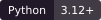
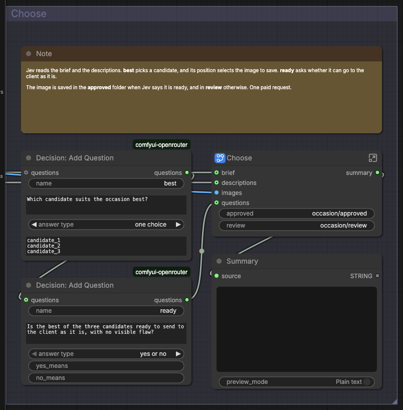

# ComfyUI OpenRouter


[](#requirements)
[](#requirements)
[](#nodes)
[](#example-workflows)
[](LICENSE.md)

**Run any model on OpenRouter from ComfyUI, with your own API key.**

The extension adds 13 nodes. Twelve cover six kinds of model, and **Request
Options** sets provider choices for the eight paid ones:

-  Ask a model a question, with images, video,
  audio, or documents. Get back text, images, or speech.
-  Generate and edit images, including masks
  and SVG files.
-  Make a video from a prompt, frames, or
  reference media.
-  Turn text into speech, optionally in a
  cloned voice, and speech into text with timestamps and subtitles.
-  Turn text and images into embeddings
  (lists of numbers that place similar items close together), and rank them
  against a query.
-  Ask a decision model, such as
  TypeSafe's Jev, typed questions. It answers with probabilities, so a workflow
  can branch on the answers.
-  Choose providers, price
  limits, and extra request fields for any paid node.


From left: an invitation cover picked by Jev from three models (image-01), a
draft Jev rejected as distorted (image-02), a logo drawn as SVG and as a sticker
(image-04), the best of four hero images (search-02), and a frame of a product
teaser video (video-01).

Requests go from your ComfyUI server to OpenRouter, which passes them to the
model's provider (the company that runs the model) and bills your OpenRouter
account. Every run of a paid node is billed, so check the model's price in
**OpenRouter models** before you run it.

## Contents

- [Requirements](#requirements)
- [Install](#install)
- [First run](#first-run)
- [Example workflows](#example-workflows)
- [Nodes](#nodes)
- [Models](#models)
- [How a run works](#how-a-run-works)
- [Development](#development)
- [Common problems](#common-problems)
- [License](#license)

## Requirements

- Python 3.12 or later.
- ComfyUI 0.34.6 or later, with frontend 1.49.6 or later in the 1.x series.
- An OpenRouter account with credit, and an API key from
  openrouter.ai/settings/keys.
- Network access from the ComfyUI server to openrouter.ai.

## Install

1. Stop ComfyUI.
2. Put the extension in `ComfyUI/custom_nodes/comfyui-openrouter`, with
   `__init__.py` and `requirements.txt` directly inside that folder.
3. Install `requirements.txt` with the Python that runs ComfyUI, using the
   command for your installation below.
4. Start ComfyUI and reload its window.

### Comfy Desktop

1. In the instance chooser, select the **⋮** icon on the instance card, then
   **Manage**.
2. Under **About**, copy **Location**. In that folder, find the `ComfyUI` folder
   that holds `main.py`, and put the extension in its `custom_nodes` folder.
3. Select **Terminal** in the same panel. It opens in the ComfyUI folder with
   the installation's Python. Run:

```sh
pip install -r custom_nodes/comfyui-openrouter/requirements.txt
```

Then start the installation. [Comfy Desktop's Manage panel](https://docs.comfy.org/installation/desktop/usage/manage)
explains these controls.

### macOS or Linux

From the ComfyUI folder, replacing `.venv` if your environment has another name:

```sh
.venv/bin/python -m pip install -r custom_nodes/comfyui-openrouter/requirements.txt
```

With uv:

```sh
uv pip install --python .venv/bin/python -r custom_nodes/comfyui-openrouter/requirements.txt
```

### Windows

From the ComfyUI folder, in PowerShell:

```powershell
.\.venv\Scripts\python.exe -m pip install -r .\custom_nodes\comfyui-openrouter\requirements.txt
```

### Windows portable

From the folder that holds `ComfyUI` and `python_embeded`, in PowerShell:

```powershell
.\python_embeded\python.exe -m pip install -r .\ComfyUI\custom_nodes\comfyui-openrouter\requirements.txt
```

To update or remove the extension, see the
[advanced guide](ADVANCED.md#update-or-remove).

## First run

1. Open **ComfyUI menu → Extensions → OpenRouter → OpenRouter settings** and
   save your API key. It is stored on the server, in the extension's private
   folder.
2. Open **Browse Templates → comfyui-openrouter →
   decision-01-verify-then-escalate**, or drag
   [its file](example_workflows/decision-01-verify-then-escalate.json) onto the
   canvas.
3. Select **Run**.
4. Read the answer in **Answer**, and Jev's check in **Summary**.

To stop a run, use ComfyUI's cancel button. To send the same request again,
change **run number**. Each request's charge is listed at
openrouter.ai/activity.

## Example workflows

There are 13 example workflows, and together they use every node. In 12 of
them, Jev decides something: which image to keep, whether a draft is distorted,
or whether an answer is backed by its sources.

Open one from **Browse Templates → comfyui-openrouter**, or drag its file onto
ComfyUI. Each group has a note that says what it does; start with **Start
Here**. Each step after the inputs is a subgraph: select the icon at its
top-right corner to open it. Media inputs start empty, so add your own image,
audio, or document.



Some workflows use ComfyUI's **If/Else Switch** (beta). It runs only the branch
it picks, so you pay only for the paid nodes on that branch.

After an update, open the examples in a new tab to get the new versions.

### Chat

| Workflow                                                                                | Input                               | Node guide                                                        |
| --------------------------------------------------------------------------------------- | ----------------------------------- | ----------------------------------------------------------------- |
| [Chat: Write a Product Listing](example_workflows/chat-01-write-a-product-listing.json) | Two product photos and a spec sheet | [Chat: Attach Document](web/docs/OpenRouterChatAttachDocument.md) |
| [Chat: Caption a Training Set](example_workflows/chat-02-caption-a-training-set.json)   | A folder of images                  | [Chat: Ask](web/docs/OpenRouterChatAsk.md)                        |

### Images

| Workflow                                                                                                          | Input                          | Node guide                                                        |
| ----------------------------------------------------------------------------------------------------------------- | ------------------------------ | ----------------------------------------------------------------- |
| [Image: Pick the Best Image for an Occasion](example_workflows/image-01-pick-the-best-image-for-an-occasion.json) | A brief                        | [Image: Generate](web/docs/OpenRouterImageGenerate.md)            |
| [Image: Reject Distorted Images](example_workflows/image-02-reject-distorted-images.json)                         | A subject                      | [Search: Embed](web/docs/OpenRouterSearchEmbed.md)                |
| [Image: Edit with the Best Idea](example_workflows/image-03-edit-with-the-best-idea.json)                         | A product photo and a campaign | [Decision: Read Answer](web/docs/OpenRouterDecisionReadAnswer.md) |
| [Image: Design a Logo](example_workflows/image-04-design-a-logo.json)                                             | A brand description            | [Image: Generate](web/docs/OpenRouterImageGenerate.md)            |

### Video

| Workflow                                                                                      | Input                 | Node guide                                             |
| --------------------------------------------------------------------------------------------- | --------------------- | ------------------------------------------------------ |
| [Video: Animate a Product Shot](example_workflows/video-01-animate-a-product-shot.json)       | A brief               | [Video: Generate](web/docs/OpenRouterVideoGenerate.md) |
| [Video: Recover a Cancelled Video](example_workflows/video-02-recover-a-cancelled-video.json) | A cancelled video job | [Video: Download](web/docs/OpenRouterVideoDownload.md) |

### Audio

| Workflow                                                                        | Input                       | Node guide                                                 |
| ------------------------------------------------------------------------------- | --------------------------- | ---------------------------------------------------------- |
| [Audio: Triage a Voicemail](example_workflows/audio-01-triage-a-voicemail.json) | A voicemail                 | [Audio: Transcribe](web/docs/OpenRouterAudioTranscribe.md) |
| [Audio: Dub a Clip](example_workflows/audio-02-dub-a-clip.json)                 | A short clip of one speaker | [Audio: Speak](web/docs/OpenRouterAudioSpeak.md)           |

### Search

| Workflow                                                                                        | Input                        | Node guide                                       |
| ----------------------------------------------------------------------------------------------- | ---------------------------- | ------------------------------------------------ |
| [Search: Answer from Help Articles](example_workflows/search-01-answer-from-help-articles.json) | A question and help articles | [Search: Rank](web/docs/OpenRouterSearchRank.md) |
| [Search: Choose a Hero Image](example_workflows/search-02-choose-a-hero-image.json)             | A brief                      | [Search: Rank](web/docs/OpenRouterSearchRank.md) |

### Decision

| Workflow                                                                                                  | Input                | Node guide                                         |
| --------------------------------------------------------------------------------------------------------- | -------------------- | -------------------------------------------------- |
| [Decision: Verify a Quick Answer, Then Escalate](example_workflows/decision-01-verify-then-escalate.json) | Notes and a question | [Decision: Ask](web/docs/OpenRouterDecisionAsk.md) |

**Request Options** is used in **Chat: Write a Product Listing**, to keep the
listing away from providers that store data.

## Nodes

The nodes are in ComfyUI's node menu under **OpenRouter**: 12 in the groups
Chat, Image, Video, Audio, Search, and Decision, and **Request Options** at the
top. Eight nodes send a paid request each time they run; the other five prepare
or read data and are free. ComfyUI's node help opens each node's guide.


| Group                                           | Node                                                                | What it does                                                           | Paid |
| ----------------------------------------------- | ------------------------------------------------------------------- | ---------------------------------------------------------------------- | ---- |
|                | [Chat: Ask](web/docs/OpenRouterChatAsk.md)                          | Asks a model a question, with images, video, audio, or documents.      | Yes  |
|                | [Chat: Attach Document](web/docs/OpenRouterChatAttachDocument.md)   | Attaches a PDF or text file from ComfyUI's input folder.               | No   |
|              | [Image: Generate](web/docs/OpenRouterImageGenerate.md)              | Generates or edits images, with masks and SVG files.                   | Yes  |
|              | [Video: Generate](web/docs/OpenRouterVideoGenerate.md)              | Makes a video from a prompt, frames, or reference media.               | Yes  |
|              | [Video: Download](web/docs/OpenRouterVideoDownload.md)              | Downloads a video that OpenRouter kept making after a run stopped.     | No   |
|              | [Audio: Speak](web/docs/OpenRouterAudioSpeak.md)                    | Turns text into speech, optionally in a cloned voice.                  | Yes  |
|              | [Audio: Transcribe](web/docs/OpenRouterAudioTranscribe.md)          | Turns speech into text, with timed segments, words, and subtitles.     | Yes  |
|            | [Search: Embed](web/docs/OpenRouterSearchEmbed.md)                  | Turns text and images into embeddings and compares them.               | Yes  |
|            | [Search: Rank](web/docs/OpenRouterSearchRank.md)                    | Ranks text and images by how well they match a query.                  | Yes  |
|        | [Decision: Add Question](web/docs/OpenRouterDecisionAddQuestion.md) | Adds a yes-or-no, one-choice, or score question.                       | No   |
|        | [Decision: Ask](web/docs/OpenRouterDecisionAsk.md)                  | Asks a decision model, such as Jev, the questions about a situation.   | Yes  |
|        | [Decision: Read Answer](web/docs/OpenRouterDecisionReadAnswer.md)   | Reads one answer as text, a yes flag, and numbers.                     | No   |
|  | [Request Options](web/docs/OpenRouterRequestOptions.md)             | Sets providers, price limits, and extra request fields for paid nodes. | No   |

The decision nodes use OpenRouter's alpha decisions API
(`/api/alpha/decisions`), which OpenRouter may still change.

## Models

The extension ships with a copy of OpenRouter's model list. To get the current
list and prices, open **Extensions → OpenRouter → OpenRouter models** and select
**Refresh Models**. The node dropdowns update after a refresh. The same dialog
estimates prices.

To use a model that is not in the list, choose **other model ID** in a node's
model dropdown and type its ID. You can add a variant suffix, such as `:nitro`
for the fastest providers.

Automatic checks tell you when OpenRouter's list has changed; select
**Refresh Models** to take the new list. See
[model updates](ADVANCED.md#model-updates).

## How a run works

```text
Node inputs ──▶ ComfyUI server (the key and settings stay here)
                  │ checks the inputs against the chosen model
                  ▼
               OpenRouter ──▶ the model's provider
                  │
                  ▼
Node outputs ◀── text, images, video, audio, and answers
```

1. The node checks its inputs against the chosen model's capabilities and
   stops with an error on an input the model cannot take. This happens before
   anything is sent or billed.
2. It waits for a free slot. At most **parallel requests** requests run at
   once; the default is 4.
3. It sends one request from your ComfyUI server to OpenRouter with your key.
   OpenRouter passes it to the model's provider and bills your account.
4. For video, the node records the job, checks it until the video is ready, and
   downloads it. The checks and the download are free.
5. The node turns the reply into ComfyUI outputs. Nodes connected to an empty
   output, such as `images` from a text-only model, are skipped.
6. Your save nodes write the files. ComfyUI reuses a result while the inputs
   are unchanged; change **run number** to send the request again.

The [advanced guide](ADVANCED.md#what-each-node-sends) lists what each node
sends and returns.

## Development

Development needs Git and mise. Tell the checks where ComfyUI is, in
`.mise.local.toml`:

```toml
[env]
COMFYUI_PATH = "/path/to/ComfyUI"
COMFYUI_PYTHON = "/path/to/ComfyUI/.venv/bin/python"
```

Install the tools, dependencies, and Git hooks, and run the full check:

```shell
mise trust
mise run repo:setup
mise run repo:check
```

Restart ComfyUI after changing Python. After changing the browser code, run
`mise run comfy:frontend:build`; after changing a workflow description, run
`mise run comfy:workflows:build`. The [advanced guide](ADVANCED.md#development)
lists every task.

## Common problems

| Problem                                      | Fix                                                                                                                                    |
| -------------------------------------------- | -------------------------------------------------------------------------------------------------------------------------------------- |
| No OpenRouter nodes in the menu              | Check that the folder is `ComfyUI/custom_nodes/comfyui-openrouter`, ComfyUI is 0.34.6 or later, and the console shows no import error. |
| No **OpenRouter** entry under **Extensions** | Check that `web/extension.js` exists in the extension's folder, then reload the window.                                                |
| "Set your OpenRouter API key..."             | Save the key in **OpenRouter settings**, or set `OPENROUTER_API_KEY` and restart ComfyUI.                                              |
| The settings cannot be changed               | ComfyUI runs in multi-user mode or is open from another computer. Set `OPENROUTER_API_KEY` where ComfyUI starts instead.               |
| A model is missing from a dropdown           | Select **Refresh Models** in **OpenRouter models**, or choose **other model ID** and type it.                                          |
| "Value not in list" for a model              | OpenRouter no longer lists the model. Choose another, or type its ID in **other model ID**.                                            |
| A video was not ready in time                | OpenRouter keeps making it. Add **Video: Download**, choose the job, and select **Run**.                                               |
| `pydantic` cannot be imported                | Install `requirements.txt` with the Python that runs ComfyUI, then restart.                                                            |
| Node help is missing                         | Reinstall the whole extension, including `web/docs`.                                                                                   |
| The templates are missing                    | Reinstall the whole extension, including `example_workflows`.                                                                          |
| Nodes or menus appear twice                  | Keep one `comfyui-openrouter` folder in `custom_nodes`; move copies elsewhere.                                                         |

For the messages a node shows, see [troubleshooting](ADVANCED.md#troubleshooting).
The [advanced guide](ADVANCED.md) also covers keys, settings, limits, prices,
model updates, caching, and video recovery.

## License

The code, guides, and workflows are under the [MIT license](LICENSE.md).
Third-party components keep their own licenses.
